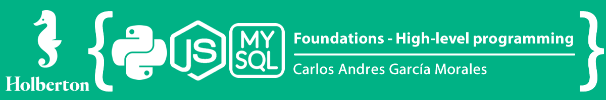

## :orange_book: Introduction

A high-level language is a programming language designed to simplify computer programming. It is "high-level" since it is several steps removed from the actual code run on a computer's processor. High-level source code contains easy-to-read syntax that is later converted into a low-level language, which can be recognized and run by a specific CPU.

## :blue_book: Languages

## :books: Content

- [python-hello_world](python-hello_world/)
- [python-if_else_loops_functions](python-if_else_loops_functions/)
- [python-import_modules](python-import_modules/)
- [python-data_structures](python-data_structures/)
- [python-more_data_structures](python-more_data_structures/)
- [python-exceptions](python-exceptions/)
- [python-classes](python-classes/)
- [python-test_driven_development](python-test_driven_development/)
- [python-more_classes](python-more_classes/)
- [python-everything_is_object](python-everything_is_object/)
- [python-inheritance](python-inheritance/)
- [python-input_output](python-input_output/)
- [python-almost_a_circle](python-almost_a_circle/)
- [SQL_introduction](SQL_introduction/)
- [SQL_more_queries](SQL_more_queries/)
- [python-object_relational_mapping](python-object_relational_mapping/)
- [python-network_0](python-network_0/)
- [python-network_1](python-network_1/)
- [javascript-warm_up](javascript-warm_up/)
- [javascript_objects_scopes_closures](javascript_objects_scopes_closures/)
- [javascript-web_scraping](javascript-web_scraping/)
- [javascript-web_jquery](javascript-web_jquery/)

## :sagittarius: Author

> :man: Omar Elati

> :e-mail: [E-mail](5796@holbertonschool.com)

> :octocat: [Github](https://github.com/OmarElati)

> :blue_book: [Linkedin](https://www.linkedin.com/in/omar-elati)

> :globe_with_meridians: [WebPage](https://omarelati.github.io/)
